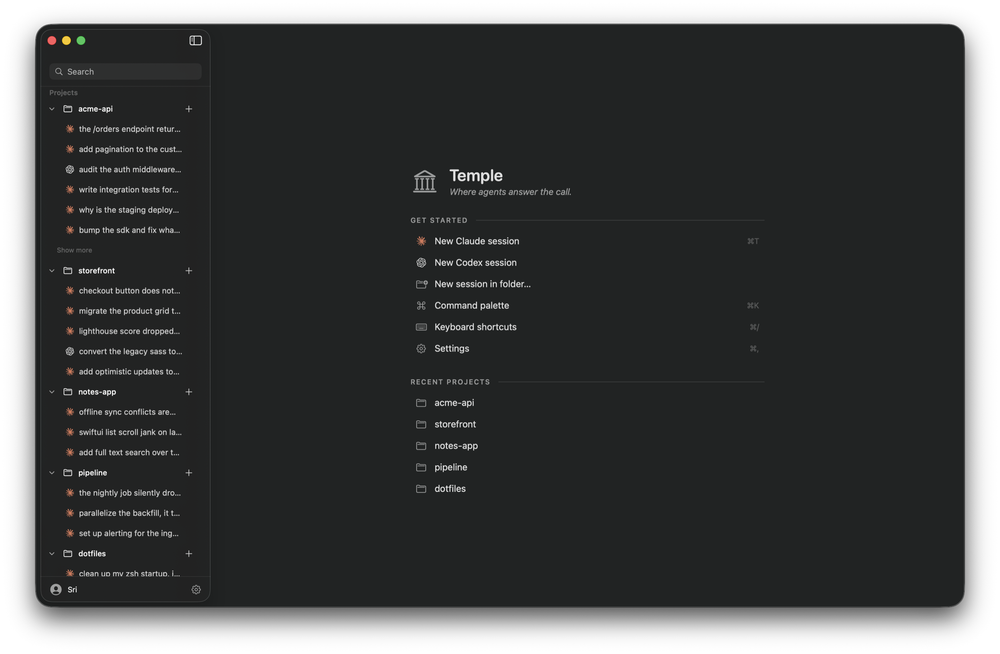

# Temple

An IDE for your Claude Code and Codex agents. Temple organizes your sessions by
project and keeps them all a click away, so you stop hunting through terminal
tabs to find the work you were doing.

- Switch between sessions across projects without losing your place.
- Search every session you have run.
- Navigate with the keyboard.
- Work in a full terminal, not a transcript.
- Pick up where you left off. Temple reopens the sessions you had open.
- See which agents are working and which are waiting on you.

Everything stays on your machine. Temple never edits your files, runs git, or
changes your session history.



## Install

```sh
brew install --cask ramsrib/tap/temple
```

Or grab the latest `Temple-vX.Y.Z-arm64.dmg` from
[Releases](https://github.com/ramsrib/temple/releases) and drag **Temple** to
Applications.

To update:

```sh
brew upgrade --cask temple
```

**Requirements:** macOS 14+ on Apple Silicon, with
[Claude Code](https://claude.com/claude-code) and/or
[Codex](https://github.com/openai/codex) installed. Temple auto-detects both
(paths configurable in Settings).

## Build from source

```sh
./Scripts/build-ghostty.sh   # one-time: builds the embedded terminal engine
make install                 # signed Temple.app → /Applications
```

Needs Xcode 26+ and `brew install xcodegen`. Zig is self-provisioned at the
pinned version. Terminal-engine details in
[docs/BUILDING-GHOSTTY.md](docs/BUILDING-GHOSTTY.md); cutting a signed,
notarized release is in [RELEASE.md](RELEASE.md).

## Learn more

- **Features & roadmap:** [docs/FEATURES.md](docs/FEATURES.md)
- **Architecture decisions:** [docs/DECISIONS.md](docs/DECISIONS.md)
- **Session storage formats:** [docs/SESSION-FORMATS.md](docs/SESSION-FORMATS.md)
- **Cutting a release:** [RELEASE.md](RELEASE.md)

Debug logging, if you ever need it:
`log stream --predicate 'subsystem BEGINSWITH "com.sriramb.temple"' --level debug`

## License

[MIT](LICENSE)
